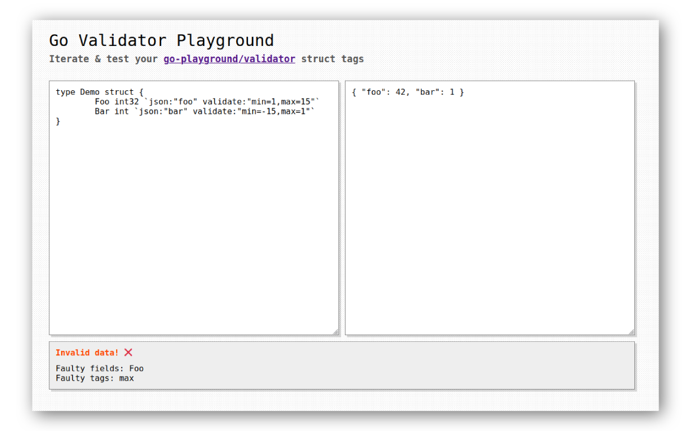

	<h1>Go Validator Playground</h1>
	

		<b>
            Iterate & test your <a href="https://pkg.go.dev/github.com/go-playground/validator/v10"><code>go-playground/validator</code></a> struct tags
        </b>
         
        <b>
            <a href="https://apps.abhijithota.me/go-validator-playground">Go to the app!</a>
        </b>
	

## What is this?

This is a simple web app that allows you to test your [`go-playground/validator`](https://pkg.go.dev/github.com/go-playground/validator/v10) struct tags.

## How does it work?

It uses [WebAssembly](https://webassembly.org/) to run the [`go-playground/validator`](https://pkg.go.dev/github.com/go-playground/validator/v10) library in the browser. 

- User enters the struct type definition.
- User enters the corresponding JSON data.
- These two (`string`) values are passed to the WebAssembly module.
- The struct definition is parsed and the struct type is created dynamically using some [`reflect`](https://golang.org/pkg/reflect/) magic.
- The JSON is unmarshalled into the struct.
- The actual validation is performed.
- Errors and invalid fields/tags are returned back to the JS code.
  
## Purpose

[`go-playground/validator`](https://pkg.go.dev/github.com/go-playground/validator/v10) library is probably the most popular Go validation library. It uses (or exploit if you're frustrated with it) struct tags to validate the particular struct fields. 

It's pretty flexible, but it's also a PITA when you misspell something or forget the syntax. This tool is here to help you with that. 

## Todo

- [ ] Tests
- [ ] Add highlights in the `textarea` for invalid fields/tags
- [ ] Syntax highlighting maybe?
- [ ] Minimum responsiveness
- [ ] Write blog post — "*A primer on Go reflection*"

## A word by the author

I mostly coded this as a way to explore WebAssembly and out of frustration with not knowing the unpredictable behaviour of struct tags.

It is mostly a proof of concept. I've tested in as much as possible *manually* but it might still fail, in which case, please reload the page and try again.

Thanks to https://gotemplate.io/ for the inspiration.

